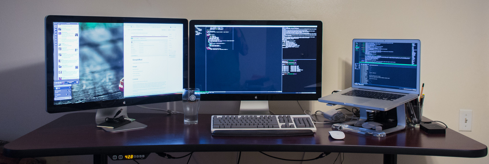

# Local Setup Instructions

We explain which operating system to pick and why. Also, how to setup your desk for maximum data science productivity.

## Table of Contents
[1. Case for Mac over Windows](#section-a)

[2. Desk Setup](#section-b)

---

### 1.  Case for Mac over Windows

**If you program regularly on a Windows or Linux computer, feel free to skip this section. Some of your fellow students are fairly new to programming and local development environments.**

Most people use Macs. They *are* expensive, but they work really well and they have a Linux-similar operating system that lets you just get down to business.  That way, you can spend more time on data science and less time trouble-shooting.

The bootcamp is intense.  Spending time wrestling with compatibility stuff you really don't have to has a high opportunity cost.

We find that things are more difficult to set up on Windows, which leads to large productivity hurdles and setbacks. On top of this, it's common for productive data scientists to not use Windows, and in particular the staff and mentors at K2 **does not** and **should not** spend their time troubleshooting Windows issues.

If you want to spend time learning how to configure things, I recommend learning how to configure Linux over learning how to configure Windows.

### If not Mac, if not Windows, then ---> Linux

You don't necessarily need to buy a new computer. Here are some alternatives:

 * **Linux Virtual Machine:**  If your computer is fairly powerful, you could run a Linux Virtual Machine inside your normal Windows install. This requires some configuration, but at least you end up with a working Linux instead of having to try to make Windows do things.
 * **Install Linux on your computer instead of or alongside Windows:**  Then you can boot to Linux instead of booting to Windows. Again, there is a good deal of configuration to be done to get this to work well, in general. We've had a couple people do the class with Linux this way.

----

## 2. Desk Setup

You should have at least 2 screens. If you have a desktop computer, you can easily add an additional graphics card to support this. If you have a laptop, please have at least 1 external high-resolution monitor. As close as you can get to the above setup will allow you to achieve maximum efficiency as a data science student. It may seem excessive, but when you are learning data science, you will have an IDE open or a Jupyter Notebook, your terminal, our online learning platform, a web page about module documentation or further background about an algorithm. The less time you spend dragging your mouse and switching between windows means the more time you have to learn and write code.

**Ideal Setup**
- Laptop on a Stand
- 2 External High-Resolution Monitors
- A Raised Keyboard
- A Wired/Wireless Mouse
- A Long Sturdy Desk
- A Paper Notepad to jot down thoughts, ideas and other notes

*Research on Productivity:*

[Monitor Size and Aspect Ratio Productivity Research](http://www.itjungle.com/tfh/utahdisplaystudy.pdf)

[Laptops and Business Use - A Study on Mice and Keyboards](https://www.bakkerelkhuizen.com/uploads/wysiwyg/BakkerElkhuizen_whitepaper_work%20comfortably%20with%20laptop_%20USv1.pdf)
