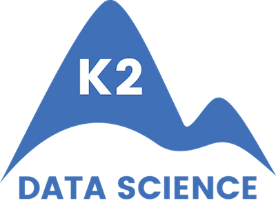

# [K2](http://www.k2datascience.com/) Data Science Bootcamp Foundations Program

# Table of Contents

[1. Foundations Program](#section-a)

[2. Submitting Work](#section-b)

[3. Questions](#section-c)

---

## 1.  Foundations Program

These materials are designed to ensure you are ready to succeed in the our data science bootcamp (or any other). Depending on your background, the material can take anywhere from 30-100+ hours to complete.

Week 0
  - [Local Setup](0-local-setup.md)
  - [Development Environment](0-environment.md)
  - [General Tips](0-general-tips.md)
  - [Doing Data Science](https://medium.com/@rchang/my-two-year-journey-as-a-data-scientist-at-twitter-f0c13298aee6#.qfovgm9ps) - Blog post from a data scientist at Twitter reflecting on his first 2 years. Note the types of data scientists, the expectations depending on the size/type of company, and the 4 general areas that his work responsibilities fall into.

Week 1
  - [Python Language Review](1-python.md)
  - [Advanced Computer Science Concepts](1-cs-concepts.md)

Week 2
  - [Flask and Web Development](2-flask.md)
  - [Web Scraping and SQL Databases](2-scraping-sql.md)
  - [APIs and NoSQL Databases](2-api-nosql.md)

Week 3
 - [Statistics & Probability](3-statistics-probability.md)
 - [Linear Algebra](3-linear-algebra.md)

Week 4
 - [Bayesian Statistics](4-bayesian-statistics.md)
 - [Multivariable Calculus](4-calculus.md)
 - [Optimization Theory](4-optimization-theory.md)

---

## 2. Submitting Work

Once you have completed all the content in Week 0, you should understand how to use Git/GitHub. These are the steps you should follow to submit work:

1. Fork the repository onto your account
2. Pull the repository down to your local computer
3. Complete assignments
3. Commit changes to the local repository and push them to your online GitHub repository
4. No need to submit a Pull Request, a TA will check your work routinely and give feedback when necessary

---

## 3. Questions

If anything is unclear or you get stuck, [please reach out immediately](<mailto:hello@k2datascience.com>). The program was created by data scientists and machine learning engineers. We have a biased view of which concepts should be learned in which order. We have tried to put ourselves in your shoes, but there is always room for improvement!
