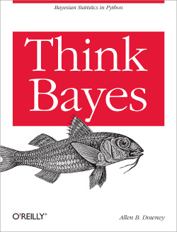

# Bayesian Statistics

## Table of Contents
[1. Course Options](#section-a)

[2. Assignments](#section-b)

---

### 1. Course Options

#### Option 1 - Shorter

[Bayes' Rule: A Tutorial Introduction to Bayesian Analysis](../resources/bayesrule.pdf)

Discovered by an 18th century mathematician and preacher, Bayes' rule is a cornerstone of modern probability theory. In this richly illustrated book, a range of accessible examples is used to show how Bayes' rule is actually a natural consequence of common sense reasoning. Bayes' rule is then derived using intuitive graphical representations of probability, and Bayesian analysis is applied to parameter estimation. As an aid to understanding, online computer code (in MatLab, Python and R) reproduces key numerical results and diagrams. The tutorial style of writing, combined with a comprehensive glossary, makes this an ideal primer for novices who wish to become familiar with the basic principles of Bayesian analysis.

*We converted an ePub version to PDF, so it does not have the greatest formatting.*

#### Option 2 - Longer

[Think Bayes](http://greenteapress.com/wp/think-bayes/) is an introduction to Bayesian statistics using computational methods.

The premise of this book, and the other books in the Think X series, is that if you know how to program, you can use that skill to learn other topics.

Most books on Bayesian statistics use mathematical notation and present ideas in terms of mathematical concepts like calculus. This book uses Python code instead of math, and discrete approximations instead of continuous mathematics. As a result, what would be an integral in a math book becomes a summation, and most operations on probability distributions are simple loops.

It is available as a [downloadable PDF](http://www.greenteapress.com/thinkbayes/thinkbayes.pdf) or you can browse the [online HTML version](http://www.greenteapress.com/thinkbayes/html/index.html). Several example programs and solutions to some exercises are located in [this GitHub repository](https://github.com/AllenDowney/ThinkBayes).

---

### 2. Assignments

1. Read the entire book. Complete the 1st exercise at the end of each chapter. The rest are optional, but highly recommended.
